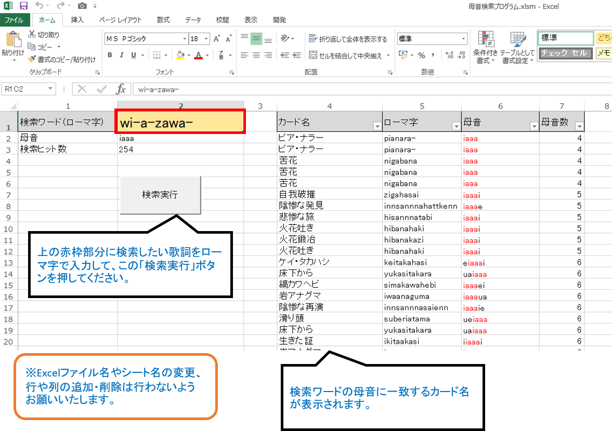

# ツール名
MTG_parody_creater

# 概要
任意の日本語を入力すると、その日本語に似た単語を名前に含むMTGカード名を出力します。
このツールを用いることで、MTGカード名を用いた替え歌を円滑に作成することができます。

※MTGとは、Magic: The Gatheringというトレーディングカードゲームです。
# 言語
- VBA

# 使用ライブラリ
- Microsoft Excel 15.0 Object Library
- Microsoft HTML Object Library
- Microsoft Internet Controls
- Microsoft Office 15.0 Object Library
- OLE Automation
- Visual Basic For Applications

# 制作背景

# 利用方法
## 前提条件
「マジック：ザ・ギャザリングのカード名だけで歌ってみた」というタイトルでYouTubeに動画を投稿されている、シンガロンパレードみっちーさんから着想を得ました。

動画例：ココロオドル/nobodyknows+

https://www.youtube.com/watch?v=ceuXeML4558
## 手順
1. 本プログラムで使用している前述の各ライブラリを、VBEのツール→参照設定にて設定してください。

2. 画像のように入力欄に任意の日本語を入力してください。入力後、エンターキーで確定するとマクロが自動で動き、検索結果が一覧で表示されます。

# 使用技術
## ソース管理
GitHub, SourceTree

## バージョン管理
Git for Windows

## OS
Windows 10 Home