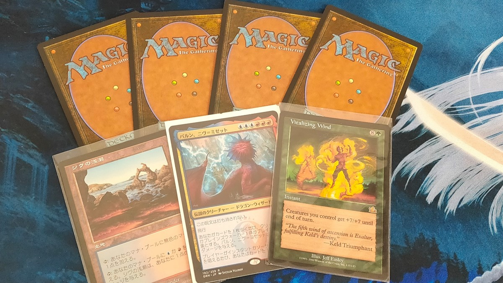
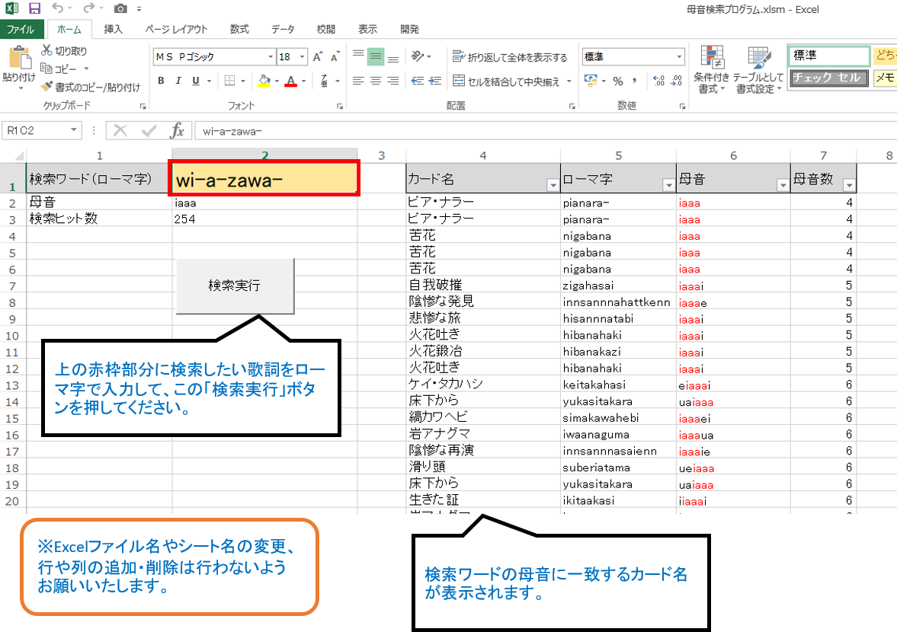

# ツール名
MTG_parody_creater（MTG替え歌作成ツール）

# 概要
任意の日本語を入力すると、その日本語に似た単語を名前に含むMTGカード名を出力します。
このツールを用いることで、MTGカード名を用いた替え歌を円滑に作成することができます。

※MTGとは、Magic: The Gatheringというトレーディングカードゲームです。[（Wizards of the Coast社 製品ホームページ）](https://magic.wizards.com/ja)

# 言語
- VBA

# 使用ライブラリ
- Microsoft Excel 15.0 Object Library
- Microsoft HTML Object Library
- Microsoft Internet Controls
- Microsoft Office 15.0 Object Library
- OLE Automation
- Visual Basic For Applications

# 制作背景
「マジック：ザ・ギャザリングのカード名だけで歌ってみた」というタイトルでYouTubeに動画を投稿されている、シンガロンパレードみっちーさんの動画から着想を得ました。

動画例（YouTube）：[ココロオドル/nobodyknows+](https://www.youtube.com/watch?v=ceuXeML4558)

私が替え歌を聴いた時に、「原曲と歌詞の雰囲気が似ている」と思うのは、原曲の歌詞と替え歌の歌詞とで似ているフレーズが使用されているとき、すなわち、それぞれの歌詞の母音が一致しているときが多いと感じました（いわゆるラップ・ミュージックにおける韻を踏む、という手法が使われているとき）。

そのため、替え歌の歌詞を作成する立場で考えると、原曲の歌詞に用いられているフレーズの母音と一致する単語がリスト化された辞書のようなものがあれば、歌詞作成を円滑に進められる可能性が高まります。したがって、MTGカード名の母音がまとまったリストを用いることで、MTGに精通していない人でも替え歌の歌詞を作成しやすくなり、「マジック：ザ・ギャザリングのカード名だけで歌ってみた」というフォーマットの競技人口が増え、この界隈が盛り上がるのではないかと考えました。

この考えのもと、本プログラムを作成しました。

# 利用方法
## 手順
1. 本プログラムで使用している前述の各ライブラリを、VBEのツール→参照設定にて設定してください。

2. 検索ワード入力欄に、任意の日本語をローマ字で入力してください。

3. ~~検索実行ボタンを押下してください。検索結果が一覧で表示されます。~~
（追記：検索ワード入力後、Enterキーで確定した時点で検索が実行されるように修正しました。）

# 仕様
- シート「データベース」には、一部例外を除き、2021年6月時点でリリースされているセット（ストリクスヘイヴン：魔法学院まで）のMTGカード名の一覧が記載されています。これらのカード名データは、Wisdom Guild様のカードデータベースより取得させていただきました。（サイトURL：http://whisper.wisdom-guild.net/
- 入力された検索ワードとカード名データとの照合は、母音"a, i, u, e, o"の完全一致で行っています。すなわち、カード名データのうち、入力された検索ワードの母音を完全に含むカード名が検索結果に出力されます。また、一致した母音は赤文字で出力されます。

# 使用技術
## ソース管理
GitHub, SourceTree

## バージョン管理
Git for Windows

## OS
Windows 10 Home